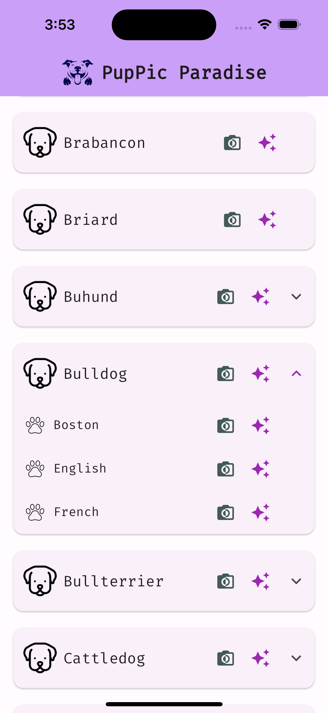
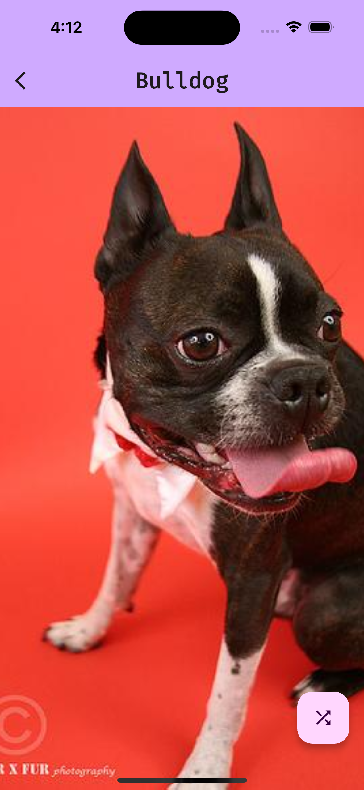

# dog_images

<h1 align="center">
 PupPic Paradise 
</h1>

    PupPic Paradise is a handy app that is used to view random images and image list of Dogs based on their selected breeds and subBreeds.

 

## How to run the app

- Clone the repository from github
- Assuming you already have flutter installed, Run `flutter pub get` at the root of the project
- If you don't have flutter installed, visit  and follow instructions
- Connect your physical device or emulator and run the application.
- 🎊🥳

 

## How it looks

 

### Dogs List Screen

This screen renders a list of dog breeds and sub breeds. If a dog breed has a sub breed, the card can be expanded to view the sub breeds.   
On each bread and side breed, there are 2 icons:
- the first icon (photo icon) navigates you to screen which shows you a random image of the breed/subBreed selected.
- the second icon (camera icon) navigates you to screen which shows you an image list of the breed/subBreed selected.

 

### Random Dog Screen

This screen renders a random image of the breed/subBreed selected from the [Dogs List Screen].   
There is also a floating action button to request another random image.

 

### Image List Screen

This screen renders an image list of the breed/subBreed selected from the [Dogs List Screen].  

 
 

## Architecture Overview

The app uses the domain driven design approach. This architecture comprises four layers (data, domain, application, and presentation).

- The presentation layer holds the UI and widgets - (actions and events flows from the presentation layer to the application layer) 
- The application layer holds the controllers, states and services.  (this layer determines how to handle the events based on the state of the app)
- The repository layer receives the events and determines which data service should handle the request based on the nature of the request
- The data layer communicates with outside data sources like API or internal local storages like sharedPrefs or SQL and returns the data back to the repository

 

## State Management & Networking 

This app uses Riverpod as its state management and Dio for networking calls.
Below are links to docs

